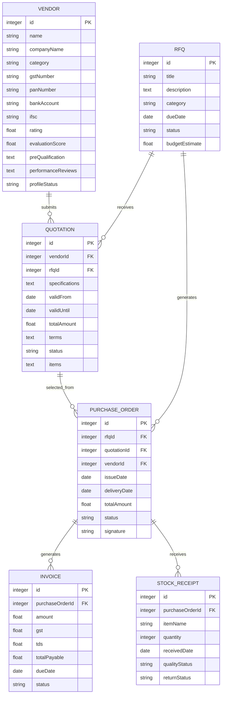

# Database Schema & ER Diagram

## Entities

- `Vendor`
  - Vendor registration, profile, GST/PAN, bank details, category, rating, evaluation score, blacklist status
- `RFQ`
  - Request for quotation with category, timeline, description, and budget estimate
- `Quotation`
  - Vendor quote submitted against an RFQ, with item pricing, validity, and terms
- `PurchaseOrder`
  - Purchase order created from selected quotation, with approval and signature workflow
- `Invoice`
  - Invoice generated from Purchase Order, with GST, TDS, payment terms, and status
- `StockReceipt`
  - Inventory receipt recorded against a PO, with quantity, quality status, and return tracking

## ER Diagram

## Notes
- The implementation uses SQLite for local setup and quick iteration.
- The schema supports procurement lifecycle from vendor onboarding to invoice and inventory receipt.
